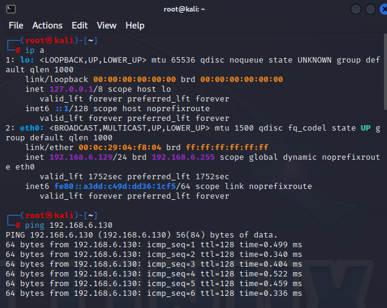
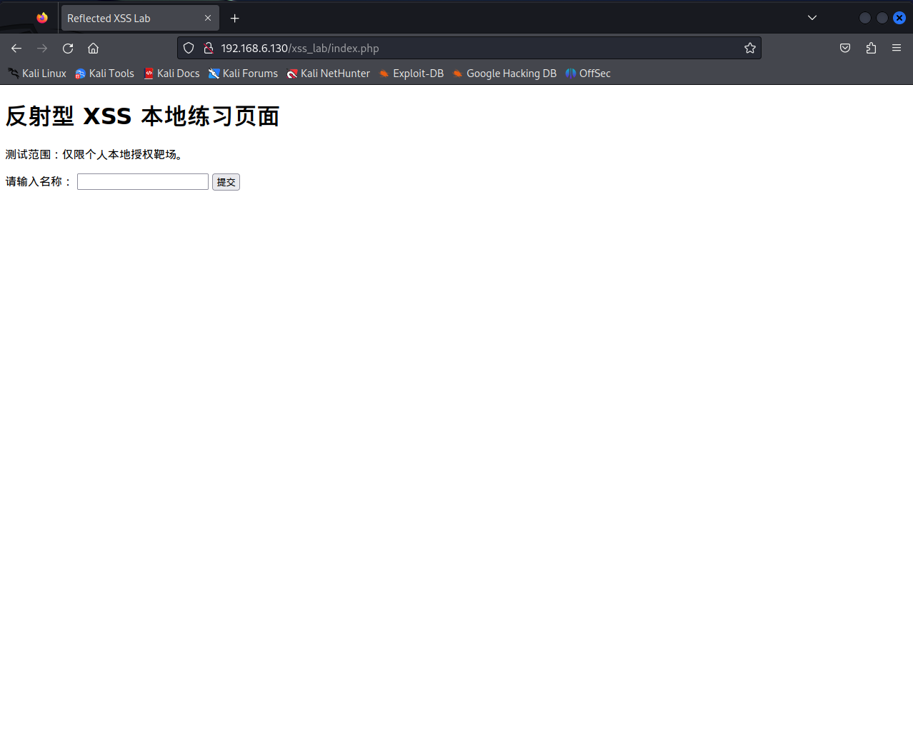
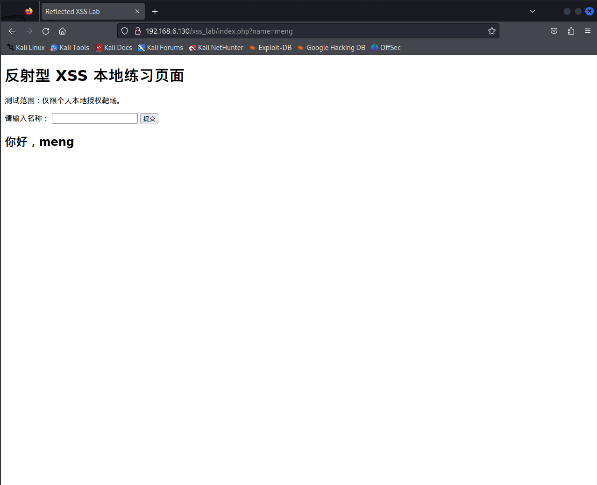
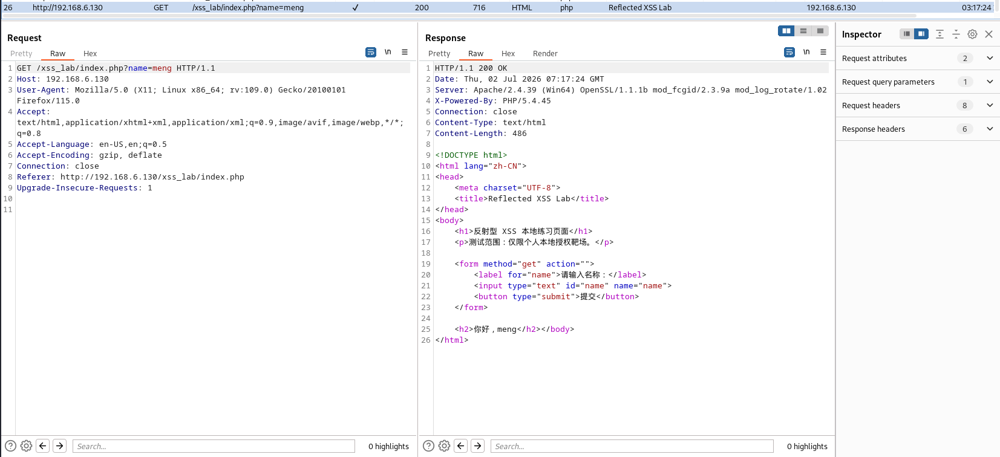
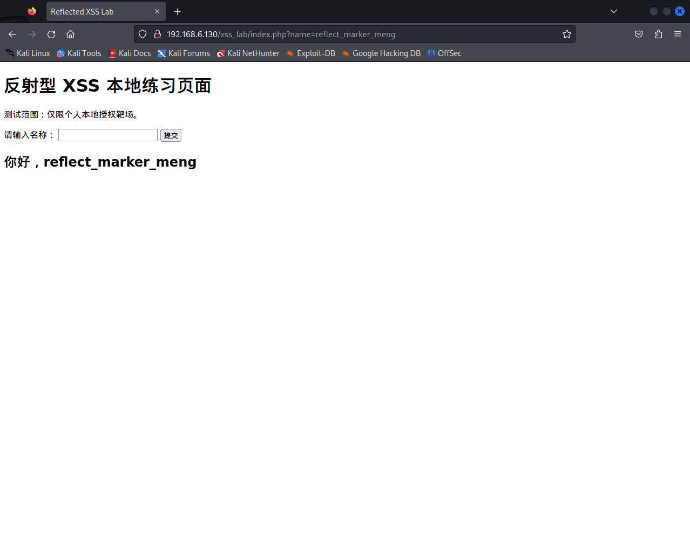
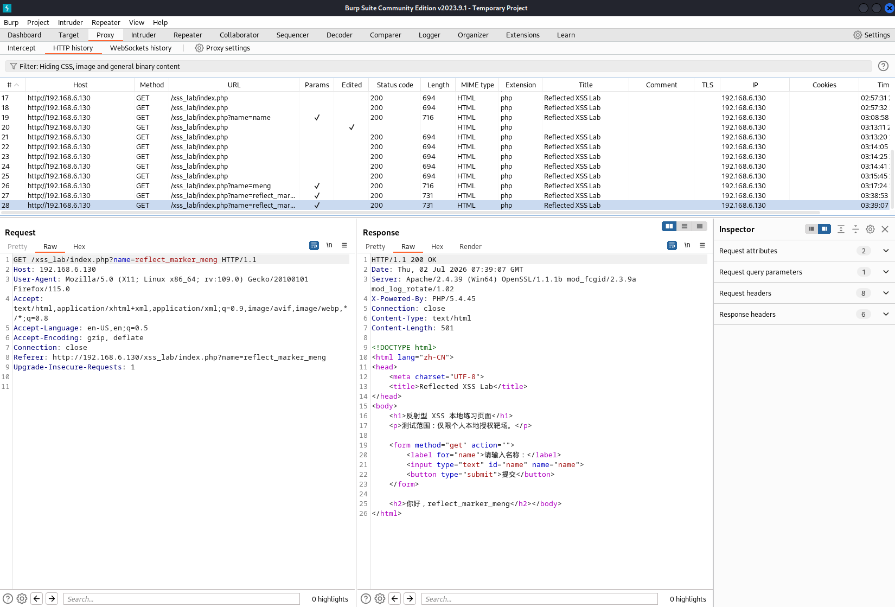
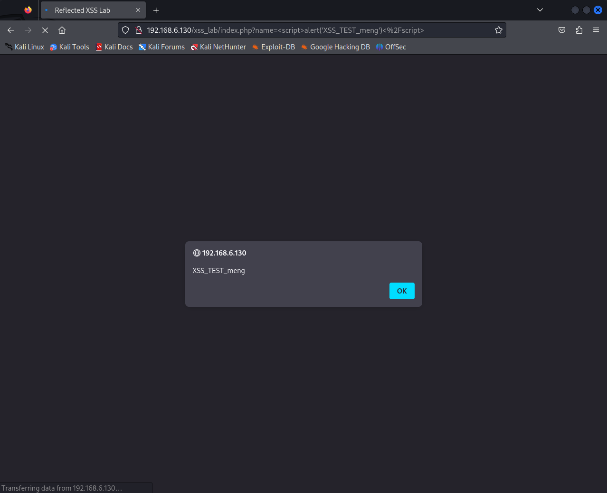
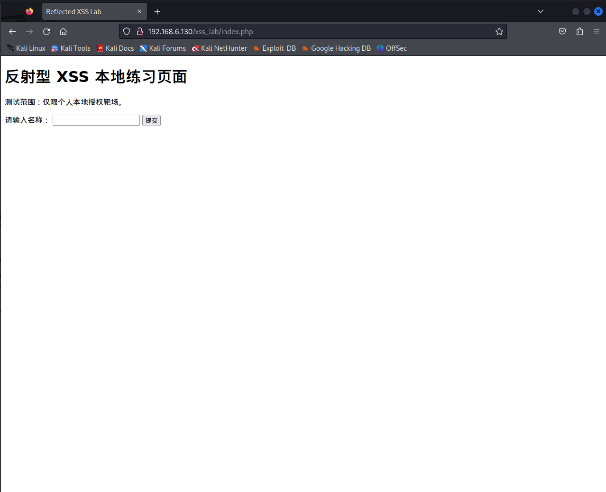
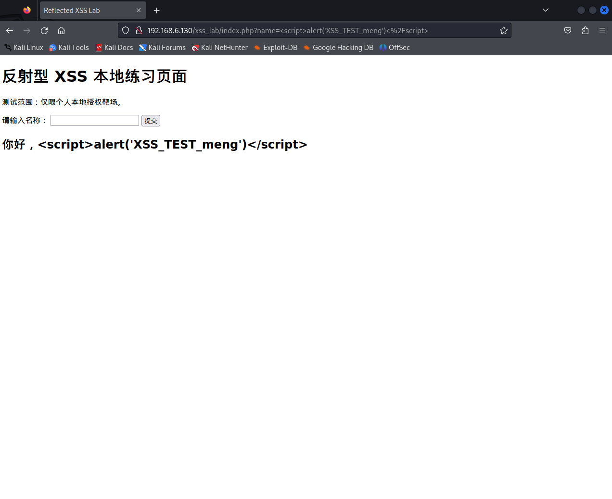

# 反射型 XSS 漏洞复现、修复与复测报告

## 1. 漏洞概述
本次测试在自建的 PHP 授权靶场中进行。

测试发现，XSS 练习页面中的 `name` 参数存在反射型 XSS 风险。应用程序会将用户提交的输入内容直接拼接并输出至当前 HTML 页面，未进行安全编码处理。

攻击者可通过构造包含恶意脚本内容的链接，诱导用户访问。当浏览器将用户输入作为 HTML 内容解析时，可能执行非预期脚本。

漏洞类型：反射型 XSS  
请求方式：GET  
参数位置：`name` 参数  
风险等级：中风险  

## 2. 测试授权与范围
本次测试仅在个人搭建的隔离实验环境中进行，目标为自建 PHP 反射型 XSS 练习页面，不涉及真实业务系统、真实用户数据或未授权资产。

测试范围：

http://192.168.6.130/xss_lab/index.php

## 3. 实验环境
虚拟化平台：VMware Workstation

测试机：

操作系统：Kali Linux  
IP 地址：192.168.6.129  
工具：Firefox（配置 Burp 代理）、Burp Suite Community Edition 

靶机：

操作系统：Windows 10  
IP 地址：192.168.6.130  
靶场：自建 PHP 反射型 XSS 练习页面  
Web 服务：Apache  
PHP 环境：PHP 5.4.45  
Web 根目录：phpStudy WWW 目录下的 xss_lab 实验目录

网络模式：
测试机与靶机均使用 VMware NAT 模式。
 
## 4. 测试思路与方法
本次测试先确认页面能够正常访问，并通过普通输入验证 `name` 参数是否会影响页面返回内容。

随后使用唯一标记文本确认用户输入是否会在当前响应中被直接反射至页面，并通过 Burp Suite 分析请求方式、参数位置以及响应中的输出位置。

在本地授权环境中，使用无害方式验证浏览器是否会将用户输入作为可执行 HTML 或脚本内容处理。最后结合输入是否只出现在当前响应、是否未被服务端持久化保存等特征，确认该问题属于反射型 XSS，并整理风险、修复建议和复测方案。

## 5. 漏洞复现过程
### 5.1 正常功能基线验证
测试目的：
确认自建 PHP 反射型 XSS 练习页面能够正常访问，并记录普通输入提交后的请求方式、参数位置和页面返回内容，作为后续漏洞验证的对照。

测试输入：
`meng`

测试过程：
在 Kali Linux 测试机中使用 Firefox 浏览器访问自建 XSS 练习页面：
http://192.168.6.130/xss_lab/index.php
在“请输入名称”输入框中填写普通文本 `meng`，随后点击“提交”按钮。

响应现象：
提交后，页面正常返回“你好，meng”。
Burp Suite HTTP history 中记录到对应请求，请求内容如下：
`GET /xss_lab/index.php?name=meng HTTP/1.1`
Host: 192.168.6.130
服务端返回 HTTP 200 状态码。
在响应源码中可以看到，页面将输入内容返回至 HTML 页面，返回位置如下：
`<h2>你好，meng</h2>`

分析与结论：
普通输入内容能够通过 `name` 参数传递至服务端，并影响当前页面的返回内容。
根据 Burp 抓取到的请求可确认，该页面使用 GET 请求方式接收用户输入，`name` 参数位于 URL 查询字符串中，是后续 XSS 测试的主要输入点。

证据截图：
图 3 正常功能基线验证结果。  
图 4 Burp 抓取到的正常 GET 请求与响应。

### 5.2 输入反射位置确认
测试目的：
确认用户提交的输入内容是否会在当前请求的响应页面中被直接返回，并初步判断输入内容与页面输出位置之间的关系。

测试输入：
`reflect_marker_meng`

测试过程：
在页面输入框中提交唯一标记文本 reflect_marker_meng，随后观察页面返回内容及浏览器地址栏中的请求参数。

响应现象：
提交后，页面显示“你好，reflect_marker_meng”。
浏览器地址栏中显示输入内容通过 name 参数传递：
http://192.168.6.130/xss_lab/index.php?name=reflect_marker_meng

分析与结论：
唯一标记文本在提交后立即出现在当前响应页面中，说明 name 参数的用户输入会被应用返回至页面。
此时仅能初步确认存在输入反射行为；后续仍需通过 Burp Suite 查看响应源码，确认该输入在 HTML 中的具体输出位置及是否经过安全编码处理。

证据截图：
图 5 唯一标记文本被反射到页面的验证结果。

### 5.3 Burp 请求与响应分析
测试目的：
通过 Burp Suite 分析请求与响应内容，确认 name 参数的用户输入在 HTML 响应中的具体输出位置，并判断是否存在直接拼接输出的情况。

测试输入：
`reflect_marker_meng`

测试过程：
在 Firefox 中提交唯一标记文本 reflect_marker_meng 后，使用 Burp Suite HTTP history 查找对应的 GET 请求，并查看服务端返回的响应源码。

请求内容：
`GET /xss_lab/index.php?name=reflect_marker_meng HTTP/1.1`
Host: 192.168.6.130

响应现象：
服务端返回 HTTP 200 状态码。
在响应源码中可以看到，用户输入被输出在 HTML 的 h2 标签内部，输出位置为：
`<h2>你好，reflect_marker_meng</h2>`

分析与结论：
Burp 响应源码表明，name 参数中的用户输入会被直接输出至 HTML 文本上下文中的 h2 标签内部。
该步骤确认了输入反射行为及其输出位置。是否存在可执行风险，还需通过后续无害脚本验证确认浏览器是否会将特殊字符内容作为 HTML 或脚本解析。

证据截图：
图 6 Burp 响应中用户输入被直接输出至 HTML 的证据。

### 5.4 无害执行验证
测试目的：
在个人本地授权靶场中验证，name 参数中的输入是否会被浏览器作为可执行脚本内容解析。

测试输入：
``

测试过程：
在 XSS 练习页面的输入框中提交上述测试内容，并观察浏览器返回现象。

响应现象：
提交后，浏览器弹出内容为 XSS_TEST_meng 的提示框。

分析与结论：
提示框成功弹出，说明应用返回页面中的用户输入被浏览器作为可执行脚本内容解析，而非仅作为普通文本显示。
本次验证仅用于证明本地授权靶场存在脚本执行风险，未读取 Cookie、未获取会话信息，也未进行任何真实数据访问或攻击扩展操作。

证据截图：
图 7 本地靶场中的无害 XSS 执行验证结果。

### 5.5 漏洞类型确认
测试目的：
确认用户输入是否仅在当前请求的响应页面中出现，并判断该问题是否属于反射型 XSS。

测试过程：
完成无害执行验证后，重新访问不携带 name 参数的初始页面：
http://192.168.6.130/xss_lab/index.php

响应现象：
重新访问页面后，页面恢复为初始状态，未再次显示此前提交的标记文本，也未再次触发 XSS_TEST_meng 提示框。

分析与结论：
用户输入仅在携带 name 参数的当前请求响应中被返回。重新访问不带参数的页面后，未发现输入内容被保存或再次执行的情况。
结合前序请求、响应分析与无害执行验证结果，可确认该问题属于反射型 XSS 漏洞。

证据截图：
图 8 重新访问页面后的非持久化验证结果。

## 6. 漏洞危害分析
### 6.1 已验证风险
本次测试已验证，攻击者可通过构造包含脚本内容的 name 参数，使应用页面将用户输入直接返回至 HTML 响应中。

在个人本地授权靶场中提交无害测试内容后，浏览器成功弹出 XSS_TEST_meng 提示框，证明用户输入能够被浏览器作为可执行脚本内容解析。

该漏洞表明，若用户访问包含恶意输入的构造请求，页面可能在用户浏览器中执行非预期脚本。

本次测试仅验证了脚本执行风险，未读取 Cookie、未获取会话信息、未访问真实数据，也未进行任何攻击扩展操作。

### 6.2 潜在风险
若类似问题存在于真实业务系统中，攻击者可能通过构造包含恶意输入的链接，诱导用户访问受影响页面，从而在用户浏览器中执行非预期脚本。

在缺少相应安全防护措施的情况下，该问题可能被用于页面内容篡改、伪造钓鱼界面、诱导用户执行非预期操作等。

具体影响还需结合实际业务功能、用户权限、Cookie 的 HttpOnly、Secure、SameSite 属性，以及 Content Security Policy（CSP）等安全策略进一步评估。

本次测试仅在个人搭建的本地授权靶场中进行，未对真实业务系统、真实用户数据或会话信息进行任何验证。

## 7. 漏洞成因分析
漏洞产生的根本原因是应用程序将用户可控的 name 参数直接拼接至 HTML 页面中输出，但未根据 HTML 输出上下文进行安全编码处理。

页面中的关键代码逻辑会直接读取 $_GET['name'] 参数，并将其拼接到 h2 标签内容中返回给浏览器。由于输入内容未经过 HTML 实体编码，攻击者提交的标签或脚本内容会被浏览器当作 HTML 或 JavaScript 解析，而不是作为普通文本显示。

例如，本次测试中提交的脚本内容被直接返回至页面，浏览器随后执行其中的 alert 代码，证明该输出位置缺少有效的安全处理。

此外，页面未对输入内容的字符范围、长度和格式进行限制，也增加了恶意内容进入页面响应的可能性。

## 8. 修复建议
1. 根据输出上下文进行 HTML 编码
对于输出到 HTML 文本内容中的用户输入，应在服务端使用 `htmlspecialchars()` 等方式进行 HTML 实体编码。
例如，<、>、" 等特殊字符应被转换为普通文本形式显示，避免浏览器将用户输入解析为标签或脚本内容。

2. 避免直接拼接用户输入生成 HTML
应用程序不应直接将 $_GET['name'] 等用户可控数据拼接到 HTML 字符串中输出。
应先对输入进行安全处理，再将处理后的内容输出至页面。

3. 增加输入校验
应根据业务需求限制 name 参数允许的字符范围、长度和格式。
例如，名称字段通常只允许中文、英文、数字及少量必要符号；对于不符合规则的输入应拒绝或进行统一处理。

4. 使用可信模板或安全输出机制
在实际项目中，应优先使用具备默认转义能力的模板引擎，避免开发人员通过字符串拼接方式动态生成 HTML 内容。

5. 配置 Content Security Policy（CSP）
可通过配置 Content Security Policy 限制页面脚本加载和执行来源，降低 XSS 漏洞被利用后的影响范围。
但 CSP 只能作为辅助防护措施，不能替代服务端输出编码。

6. 设置 Cookie 安全属性
真实业务系统应合理设置 Cookie 的 HttpOnly、Secure 和 SameSite 属性，以降低 XSS 漏洞成功后可能造成的会话风险。

## 9. 修复后复测结果
### 9.1 修复措施
针对 name 参数直接输出至 HTML 页面的风险，对页面输出逻辑进行了安全编码处理。
修复前，程序会直接将 $_GET['name'] 参数拼接至 HTML 内容中输出。
修复后，先使用 htmlspecialchars() 对用户输入进行 HTML 实体编码，再输出至页面。这样 <、>、引号等特殊字符会以普通文本形式显示，避免被浏览器解析为 HTML 标签或 JavaScript 内容。

// 修复前：直接输出用户输入
`<h2>你好，<?php echo $_GET['name']; ?></h2>`

// 修复后：进行 HTML 实体编码后再输出
`<h2>你好，<?php echo htmlspecialchars($_GET['name'], ENT_QUOTES, 'UTF-8'); ?></h2>`

### 9.2 复测过程
修复完成后，重新提交此前用于无害验证的测试内容：
``

### 9.3 复测结果
页面未再弹出 XSS_TEST_meng 提示框。
测试内容以普通文本形式显示在页面中，说明浏览器未将其作为脚本执行。

### 9.4 复测结论
修复后的页面能够对用户输入进行 HTML 安全编码处理，原有的反射型 XSS 脚本执行问题未再复现。
仍建议在真实业务系统中结合输入校验、可信模板引擎、CSP 及 Cookie 安全属性等措施进行多层防护。

证据截图：
图 9 修复后复测结果。

## 10. 总结
本次测试在个人搭建的本地授权环境中完成。通过正常功能验证、输入反射确认、Burp 请求与响应分析及无害脚本执行验证，确认 name 参数存在反射型 XSS 漏洞。

漏洞原因为应用程序将用户可控输入直接输出至 HTML 页面，未进行有效的 HTML 安全编码处理，导致浏览器可将输入内容解析为脚本执行。

随后对输出位置使用 htmlspecialchars() 进行 HTML 实体编码，并使用相同测试内容进行复测。复测结果表明，脚本内容已被作为普通文本显示，原有的 XSS 脚本执行问题未再复现。

## 附录：关键请求、响应与截图证据

